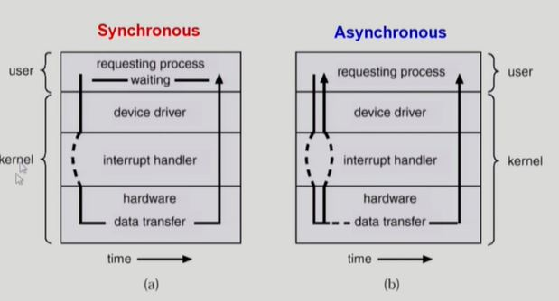
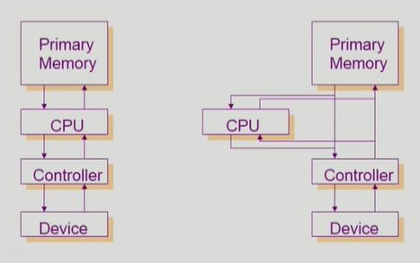
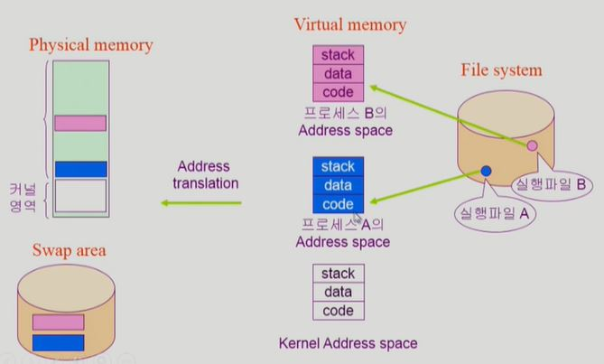
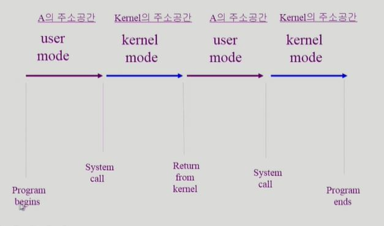
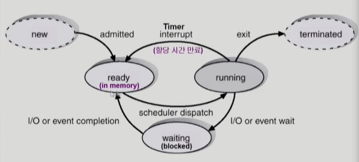

OS

## Chapter 2. System Structure & Program Excution

- 컴퓨터 시스템 구조

  - 

  - Computer : CPU + Memory

    - CPU : register(Memory보다 작고 빠른 연산자) + mode bit(OS, 사용자 명령 구분)  + Interrupt line(Memory, Disk 등의 연산이 끝났는지 확인)
      - program counter가 가리키는 register(memory 주소)에서 Instruction을 실행
    - Memory : CPU와 직접 동작하는 부분, 사용자의 요청 등을 처리함, CPU와 DMA controller만 접근 가능
    - CPU는 굉장히 빠른 장치로 Memory와 I/O에 접근하여 연산을 처리함. 만약 Memory에 무한루프가 걸리면 CPU의 시분할이 불가능해짐.
      - timer를 통해 특정 Memory의 CPU독점을 방지함
    - 사용자 프로그램은 직접 I/O에 접근할 수 없음. 따라서 OS를 통해서 I/O에 접근해야함. 
    - 그리고 OS는 사용자 프로그램에 CPU를 할당할 순 있으나, 강제로 다시 가져올 순 없음
    - 사용자 프로그램이 종료 (I/O 요청, 연산 종료 등) 또는 time out되면 CPU는 다시 OS에 할당됨
    - 만약 어떤 프로그램에서 CPU가 사용되고 있고, 다음 프로그램이 정해져 있더라도 I/O 큐or스택에 넣어놓은 연산이 완료되면 연산이 완료된 I/O에 할당 시킴
    - Mode bit
      - 사용자 프로그램의 잘못된 수행으로 다른 프로그램 및 운영체제에 피해가 가지 않도록 하기 위한 보호 장치
      - Mode bit을 총해 하드웨어적으로 두가지 모드의 operation지원
        - 1 : 사용자모드 : 사용자 프로그램이 CPU 사용중
          - 보안상의 목적으로 제한된 권한이 주어짐
        - 0 : 모니터모드 : OS가 CPU 사용중 ( == 커널모드, 시스템모드 )
          - memory 접근, I/O 접근 등 모든 권한을 가짐
        - Interrupt나 Exception 발생 시 하드웨어가 mode bit을 0으로 바꿈
        - OS가 사용자 프로그램에서 CPU를 넘기기 전에 mode bit을 1로 셋팅
    - Timer
      - 특정 프로그램이 CPU를 독점하는 것을 막기위해 사용
      - 정해진 시간이 흐른 뒤 OS에게 제어권이 넘어가도록 Interrupt를 발생시킴
    - 매 클럭 틱 때마다 1씩 감소
  
- I/O Device : Disk + Monitor + ...
  
  - I/O device controller
  
      - I/O 장치 유형을 관리하는 일종의 작은 CPU
      - 제어 정보(CPU의 요청)를 위해 control register, status register를 가짐
      - local buffer(Memory의 요청을 임시 저장)를 가짐 (일종의 data register)
      - device controller는 I/O가 끝났을 경우 interrup로 CPU에 그 사실을 알림
      - device driver (장치 구동기)
        - OS코드 중 각 장치별 처리 루틴 == software
      - device controller (장치 제어기)
      - 각 장치를 통제하는 일종의 작은 CPU == hardware
  
  - DMA controller
  
      - Director memory access
      - memory에 접근할수있는 다른 하나
      - memory controller가 교통정리의 역할
    - DMA는 I/O로 부터의 요청이 너무 많아 Interrupt가 자주 걸려 CPU의 효율이 떨어질 때, I/O의 요청을 memory에 대신 복사해줌으로 CPU 효율 증가
  
  - I/O의 수행
  
      - 모든 입출력 명령은 특권명령 (mode bit 0)
      - 사용자 프로그램은 어떻게 I/O를 하는가?
        - System call
          - 사용자 프로그램이 OS에 I/O를 요청
          - trap을 사용하여 interrupt vector의 특정 위치로 이동
          - 제어권이  interrupt vector가 가리키는 interrupt service routine으로 이동
          - 올바른 I/O 요청인지 확인 후 I/O 수행
          - I/O 완료 시 제어권을 System call 다음 명령으로 옮김
          - 즉, 사용자 프로그램이 OS의 서비스를 받기위해 커널 함수를 호출하는것
        - 
  
  - Interrupt
  
      - interrupt 당한 시점의 register와 program counter를 save한 후 CPU의 제어를 interrupt처리 routine에 넘긴다
      - 의미
        - interrupt (hardware) : 하드웨어가 발생시킨 interrupt
        - trap (software)
          - Exception : 프로그램이 오류를 범한 경우 ( ex. 1/0, mode bit 1일때, OS memory에 접근 시도 등 )
          - System Call : 프로그램이 커널 함수를 호출하는 경우 ( 사용자 프로그램이 OS에 요청하는 경우 )
      - 용어
        - interrupt vector
          - 해당 interrupt의 처리 루틴 주소를 가지고 있음
        - interrupt service routine (interrupt handler)
        - 해당 interrupt를 처리하는 커널 함수
  
      - 
        - Interrupt에 의해서 CPU가 움직이기 때문에,
-  동기식 입출력과 비동기식 입출력
  - 동기식 입출력 ( Synchronous I/O )
    - I/O 요청 후 입출력 작업이 완료된 후에야 제어가 사용자 프로그램에 넘어감
    - 구현방법 1
      - I/O가 끝날 때 까지 CPU를 낭비시킴
      - 매 시점 하나의 I/O만 일어날 수 있음
    - 구현방법 2
      - I/O가 완료될 때 까지 해당 프로그램에게서 CPU를 빼앗음
      - I/O 처리를 기다리는 줄에 그 프로그램을 줄 세움
      - 다른 프로그램에게 CPU를 줌
  - 비동기식 입출력 ( Asynchronous I/O )
    - I/O가 시작된 후 입출력 작업이 끝나기를 기다리지 않고 제어가 사용자 프로그램에 즉시 넘어감
  - 두가지 모두 I/O의 완료는 Interrupt로 알려줌
  - 
- DMA ( Direct Memory Access )
  - 빠른 입출력 장치를 메모리에 가까운 속도로 처리하기 위해 사용
  - CPU 중재 없이 device controller가 device의 buffer storage의 내용을 메모리에 block 단위로 직접 전송
  - byte 단위가 아니라 block 단위로 interrupt 발생시킴
  - 
- 서로 다른 입출력 명령어
  - 
  - 좌측이 일반적인 memory 접근 방법
    - memory addr와 device addr 각각으로 접근
  - 우측 Memory Mapped I/O
    - 연장된 memory addr를 통해 I/O에 접근
- 저장장치 계층 구조
  - 
  - Primary (Executable : 실행가능)
    - CPU가 직접 접근 가능, byte 단위 매체
    - Register, Cache : CPU, SRAM (휘발성)
    - Main : DRAM (휘발성)
  - Secondary : hard disk (비 휘발성)
    - byte 단위 접근 불가, sector 단위로 접근
- 프로그램의 실행 ( Memory load )
  - 
  - 모든 사용자 프로그램은 독자적인 가상공간을 가지고있음 ( 휘발성 )
  - 가상공간에 활성화된 부분을 물리적 메모리에 올려서 연산을 함
  - 연산이 끝났거나 보관이 필요한것이 아니라면 swap area로 내림
  - Swap area
    - Physical memory의 연장선 느낌
    - Physical memory가 용량 부족일때 쓰인다?
  - File system
    - on/off 등 데이터 유지에 쓰임
  - Address translation
    - 주소 관리자 ( 물리적 )
- 커널 주소 공간의 내용
  - 
  - Code : OS의 자원관리, 편리한 서비스 등 함수를 가지고 있음
  - Data : hardware 관리, 통제 및 자료구조(PCB)
  - stack : 함수를 호출할 때 사용, 사용자 프로그램마다 커널스택 따로 사용
- 사용자 프로그램이 사용하는 함수 (Code에 들어있음)
  - 사용자 정의 함수 -- 사용자 프로그램 addr space
    - 자신의 프로그램에서 정의한 함수
  - 라이브러리 함수 -- 사용자 프로그램 addr space
    - 자신의 프로그램에서 정의하지 않고 갖다 쓴 함수
    - 자신의 프로그램의 실행 파일에 포함되어 있음
  - 커널 함수 -- 커널 addr space
    - OS program의 함수
    - 커널 함수의 호출 = System call
- 프로그램 실행
  - 
  - 

## Chapter 3. Process

- Process is **a program in execution**

- 프로세스의 문맥 (context) : 현재 process의 상태를 규명하기 위해서 사용

  - CPU 수행 상태를 나타내는 하드웨어 문맥
    - Program Counter가 프로세스의 주소 공간 어디를 가리키고 있는가?
    - 각종 register에 어떤 값을 넣어두고 어떤 Instruction을 실행 했는가?
  - 프로세스의 주소 공간
    - code, data, stack
  - 프로세스 관련 커널(OS) 자료 구조
    - PCB (Process Control Block)
      - 프로세스를 관리하기위해 data 영역에 생성
      - process 하나 당 PCB 하나
    - Kernel stack
      - system call으로 kernel의 code를 호출할 때 process의 요청을 kernel stack에 저장
      - process 하나 당 Kernel stack 하나

- ### Process State - 1

  - 프로세스는 상태가 변경되며 수행된다
    - **Running**
      - CPU를 잡고 instruction을 수행중인 상태
    - Ready
      - CPU를 기다리는 상태 (메모리 등 다른 조건을 모두 만족하고)
      - ready 상태 process가 번갈아 가면서 수행되어 CPU time sharing이 일어남
    - **Blocked (wait, sleep)**
      - CPU를 주어도 당장 instruction을 수행할 수 없는 상태
      - Process 자신이 요청한 event(ex. I/O)가 즉시 만족되지 않아 이를 기다리는 상태
      - ex. 디스크에서 file을 읽어와야하는 경우
    - 경우에 따라
      - New
        - 프로세스가 생성중인 상태
      - Terminated
        - 수행 (Execution)이 끝난 상태
        - 정리만 남은 상태
    - **OS의 관리상 나누어진 상태**
  - 프로세스 상태도
    - 
    - 
      - Queue는 kernel addr의 Data에서 관리함

- ### Process Control Block ( PCB )

  - OS가 각 Process를 고나리하기 위해 process당 유지하는 정보
  - 아래의 구성 요소를 가짐 (구조체로 유지)
    - OS가 관리상 사용하는 정보
      - Process state, Process ID
      - Scheduling information, Priority
    - CPU 수행 관련 하드웨어 값
      - Program counter, register
    - Memory 관련
      - Code, Data, Stack의 위치 정보
    - File 관련
      - Open file description ...

- ### Context Switch ( 문맥 교환 )

  - CPU를 한 프로세스에서 다른 프로세스로 넘겨주는 과정
  - CPU가 다른 프로세스에게 넘어갈 때 OS는 아래를 수행
    - CPU를 내어주는 프로세스의 상태를 그 프로세스의 PCB에 저장
    - CPU를 새롭게 얻는 프로세스의 상태를 PCB에서 읽어옴
  - 
    - process가 CPU를 빼앗기게 될때 해당 시점을 process의 PCB에 CPU의 문맥을 저장함
    - CPU를 다시 받았을 때, CPU의 문맥을 통해 해당 시점부터 재시작
  - 
    - System call이나 Interupt 발생 시 반드시 context switch가 일어나는 것은 아님
      - 만약 CPU가 OS로 넘어갔다가 복귀하면 context switch가 아님
      - 그런데 OS에서 다른 프로세스로 CPU를 넘겨준다면 context switch
    - (1)의 경우에도 CPU의 수행 정보 등 context 일부를 PCB에 저장해야하지만, Context switch를 해야하는 (2)의 경우는 그 부담이 훨씬 큼
      - ex. cache memory flush

- ### 프로세스를 스케줄링하기 위한 큐

  - Job Queue
    - 현재 시스템 내에 있는 모든 프로세스의 집합
    - Ready queue와 Device queue 포함
  - Ready Queue
    - 현재 메모리 내에 있으면서 CPU를 잡아서 실행되기를 기다리는 프로세스의 집합
  - Device Queue
    - I/O device의 처리를 기다리는 프로세스의 집합
  - 프로세스들은 각 큐를 오가며 수행된다
  - 
    - Pointer를 통해 각 PCB가 연결됨
  - 

- ### Scheduler ( 스케줄러 )

  - **Long-term scheduler ( 장기 스케쥴러 or job scheduler)**
    - 시작 프로세스 중 어떤 것들을 **ready queue**로 보낼지 결정
    - 프로세스에 **memory** 및 각종 자원을 주는 문제
    - **degree of Multiprograming**을 제어
      - Memory에 올라가 있는 process의 수
      - ex. Memory : 10 , Process : 10 => degree of M : 10
      - ex. Momory : 10 , Process : 1 => degree of M : 1
      - Memory에 프로그램이 너무 많아도, 적어도 문제
    - time sharing system에는 보통 장기 스케줄러가 없음 (무조건 ready)
    - 프로그램이 시작될때 memory를 줄지 말지를 결정
  - **Short-term scheduler ( 단기 스케줄러 or CPU scheduler)**
    - 어떤 프로세스를 다음번에 **running** 시킬지 결정
    - 프로세스에 **CPU**를 주는 문제
    - milli-second 단위로 충분히 빨라야함
  - **Medium-term scheduler ( 중기 스케줄러 or Swapper )**
    - *여유 공간 마련을 위해  일부 프로세스를 통째로 memory에서 disk로 쫓아냄*
    - 프로세스에게서 **memory**를 뺏는 문제
    - **degree of Multiprograming**을 제어
    - memory에 너무많은 프로그램이 동시에 올라가있을 경우 작동

- ### Process State - 2

  - **Running, Ready, Blocked**
  - **Suspended (stopped)**
    - 외부적인 이유로 프로세스의 수행이 정지된 상태
    - 프로세스는 통째로 디스크에 swap out 된다
    - ex. 사용자가 프로그램을 일시정지시킨 경우 (break key) 
    - ex. 시스템이 여러 이유로 프로세스를 잠시 중단시킴 (메모리에 너무 많은 프로세스가 올라와 있을때)
    - 중기 스케줄러에 의해서 생겨났음
  - 비교
    - **Blocked**
      - **자신이 요청한 event가 만족되면 Ready**
    - **Suspended**
      - **외부에서 resume해 주어야 Active**
  - **OS의 상태를 나타내는게 아닌 사용자 프로세스가 kernel에서 어떤 상태(running, ready 등)에 있단것을 나타냄**
  - 프로세스 상태도
    - 
    - 점선 아래는 외부에서 어떤 신호를 줘야지 active로 올라올 수 있음

- 

