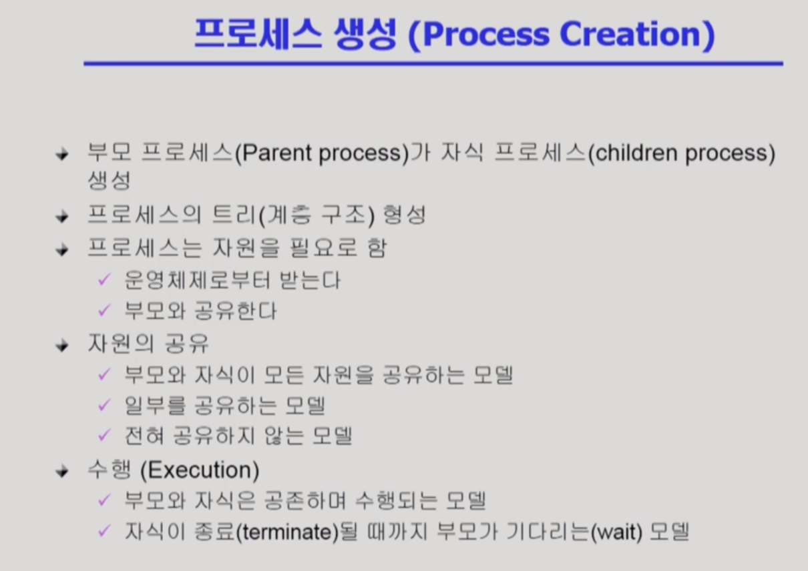
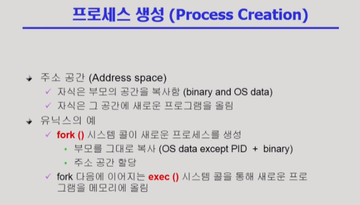
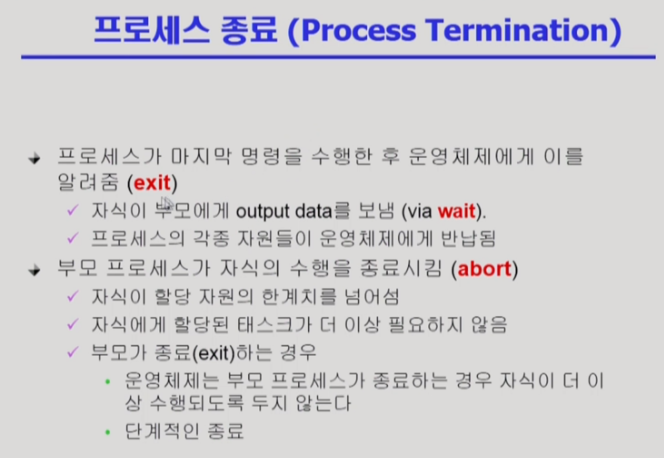

# 프로세스 생성

- 보통은 자원을 공유하지 않는 모델이 일반적이다.

- fork()로 부모 프로세스를 복제, exec()로 새로운 프로그램을 덮어 씌운다. 덮어씌우지 않을 수도 있다.
- 자식 프로세스를 만들지않고 exec()을 하면 새로운 프로세스가 될 수도 있다.

- exit 시스템 콜로 프로세스 종료.
- 자식 프로세스가 부모 프로세스보다 먼저 종료된다.