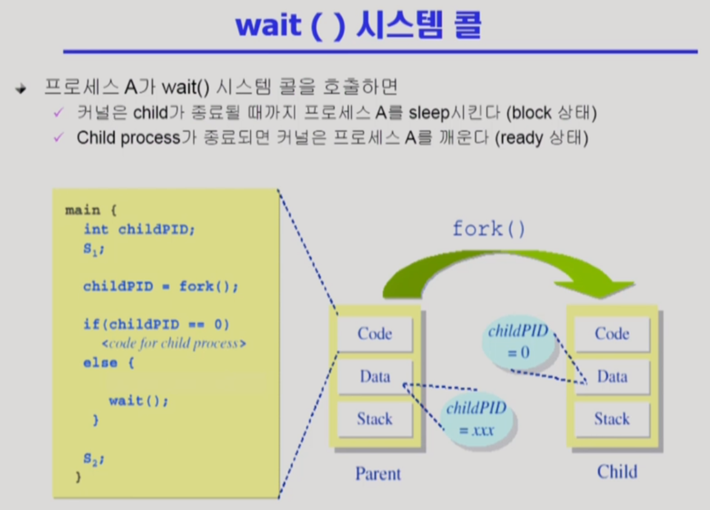

# Process Management 2

- 자식은 기본적으로 부모를 복제 생성해서 만들어진다. PC도 같은 위치를 가리키게 된다.
- 공유하지 않으면 똑같은 내용이 두 개씩 생겨서 메모리 비효율 적이다. 그래서 일단 공유하게 된다.
- 부모하고 자식이 내용이 달라지게 되면, 자식 프로세스는 공유하던 내용의 일부를 카피해서 갖게된다. (Copy-on-write) : write가 발생하면 copy한다.

- fork() 로 생성된 자식프로세스는 코드를 처음부터 실행하는 것이 아니라 fork() 이후부터 실행하게 된다. 부모의 context를 복제하기 때문에 가능한 것.
- fork()를 하면 운영체제가 자식하고 부모를 pid 값으로 구분해준다. 자식의 pid는 0. 부모는 0이상이다. 이를 통해 구분이 가능하다.

- execlp()는 내부적으로 결국 exec()를 콜하게 되어있다.
- exec()을 하면 코드의 처음부터 다시 시작한다.
- exec() 이후의 코드는 실행이 불가능하다. 다시 돌아오지 않기 때문.

- 보통 자식 프로세스를 생성 후 wait()을 호출한다.
- 리눅스 커맨드에 프로그램 이름을 쳐서 실행하면 커맨드는 프로그램이 끝날 때까지 기다리기 위해 wait()을 호출하고 대기상태에 돌입하게 된다. 프로그램이 끝나면, 즉 자식 프로세스가 종료되면 다시 커맨드를 입력할 수 있게된다.

- 'ctrl + c' 같은 경우도 비자발적 종료에 해당한다.
- 부모 프로세스가 종료되기 전에 프로세스 트리안에 있는 모든 자식 프로세스들이 종료되고 부모 프로세스가 종료된다.