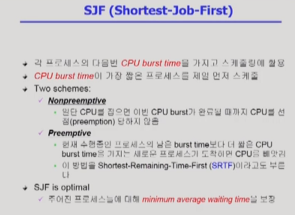

## CPU Scheduling 1
- 프로세스는 I/O 처리 위주와 CPU 처리 위주의 프로세스가 있다.
- I/O는 주로 사용자와 소통을 많이 하는 프로세스라고 할 수 있다.
- 이런 두 경우에 대해서 스케쥴링이 중요하다.

- CPU 스케쥴링은 크게 비선점형(Non Preemptive)와 선점형(Preemptive)로 나눌 수 있다.
- 요즘 사용하는 대부분의 CPU 스케쥴링 기법은 선점형이다.

- 성능 척도는 위의 그림과 같다.
- Waiting Time / Response Time 의 차이는 선점형 스케쥴링에서 CPU를 뺏길 때마다 계속 늘어난다. 하지만 Response Time은 처음으로 CPU를 얻기까지의 대기시간만 계산한다.
- Turnaround Time은 기다리는 시간 + 사용시간 합쳐서 반환하기 전까지 모든 시간을 더한 것을 의미한다. 프로세스가 끝나는 시간이 아니라 I/O 하러 가기 전까지의 시간.?

### 스케쥴링 알고리즘

- FSFC (First-Come First-Served)
  - 비선점형 알고리즘. 오는 순서대로, 각 프로세스 작업이 끝날 때까지 처리한다.
  - 효율적이지 않다. CPU가 오래쓰는 프로세스가 처음으로 도착하면 굉장히 비효율적.
  - Convoy Effct: 긴 프로세스 뒤에 있는 짧은 프로세스. 즉 굉장히 비효율적인 경우를 의미.

- SJF (Shortest-Job-First)
  - 항상 CPU burst Time이 짧은 프로세스를 스케쥴한다.
  - 기아현상(Starvation)이 발생할 수 있다. 이는 긴 burst time을 가진 프로세스는 평생 CPU를 얻을 수도 있다는 말이다.
  - 기아현상은 에이징(Aging)기법을 통해 해결할 수 있다. 오래될 수록 우선순위를 높여주는 방식이다.
  

- CPU Burst Time 예측 하는 방법이다. 최근의 프로세스의 비중치는 높게, 오래 지난 프로세스일수록 비중치를 낮게 잡아 계산하는 방식이다.

- Round Robin (RR)
  - 일반적인 스케쥴링 기법은 라운드 로빈에 기반하는 경우가 많다.
  - 응답시간이 빨라지는 장점이 있다.
  - FIFO X => FCFS O (오타 수정)
  - 적당한 q를 설정하는 것이 중요하다. 보통은 10-100 ms로 설정하는 것이 적당하다.
  - Response Time이 빨라지는 것이 라운드 로빈의 큰 장점이다. 대신 Turnaround Time은 늘어날 수 있다.

