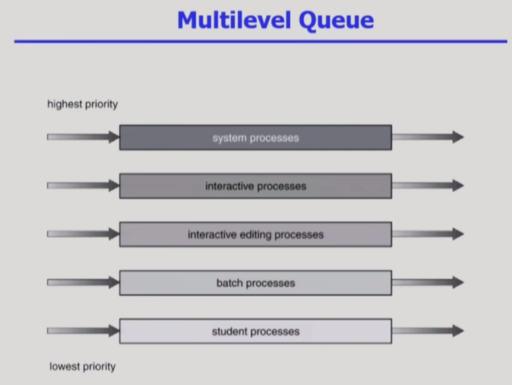
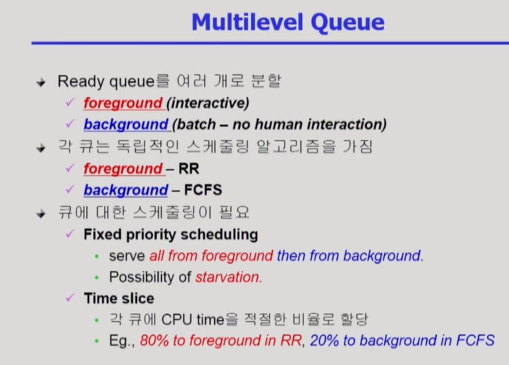
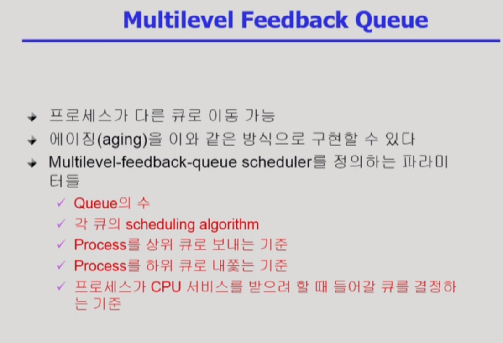
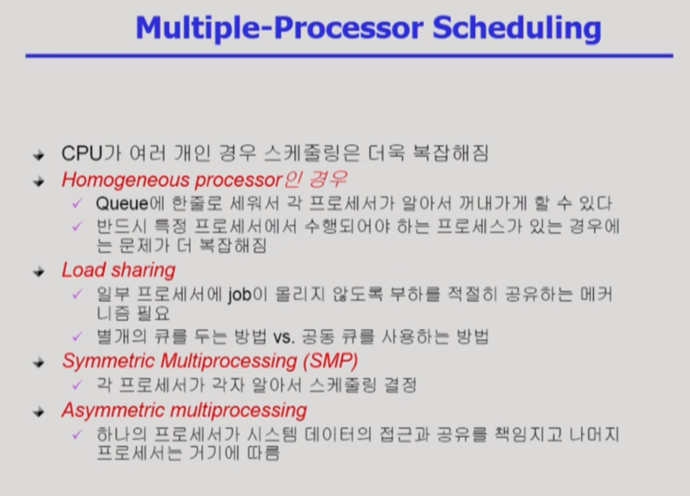
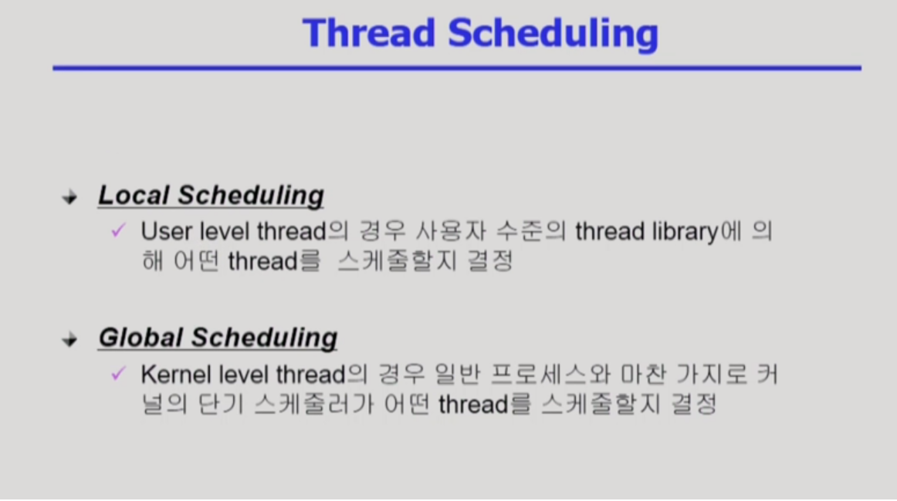
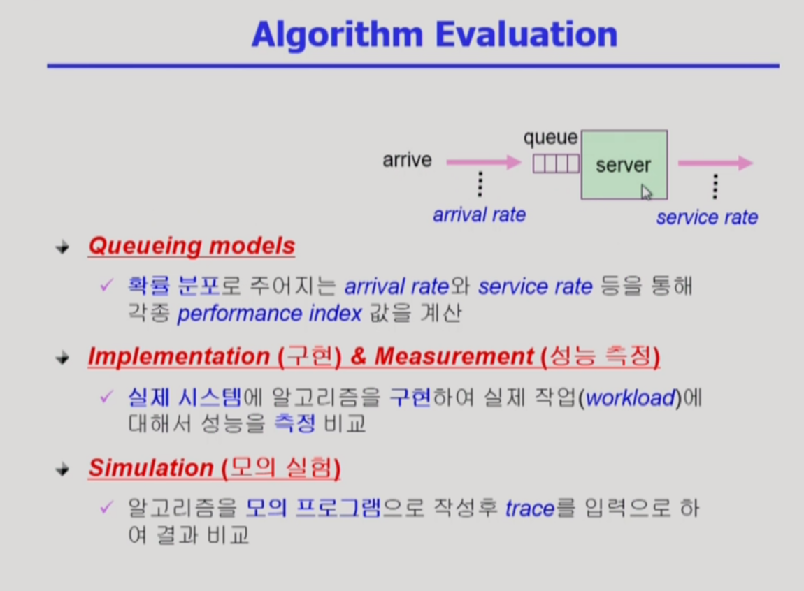

## CPU Scheduling 2

- Multilevel Queue
  - 정해진 우선순위대로 실행이 된다. 한 번 부여된 우선순위는 바뀌지 않는다. 
  - 각 큐마다 독립적인 스케줄링 기법을 갖고 있다.

- Multilebel Feedback Queue
  - 계층간 이동이 가능한 큐. 처음엔 최우선순위 큐에 배정이 되지만, 할당 시간 내에 프로세스가 종료되지 않으면 점점 낮은 우선순위 큐로 배정이 된다.
  - 근데 이러한 기준들은 유동적이다. 

- Multiple-Processor Scheduling
  

### Algorithm Evaluation (알고리즘 성능 평가)

