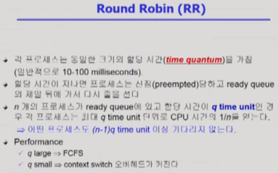
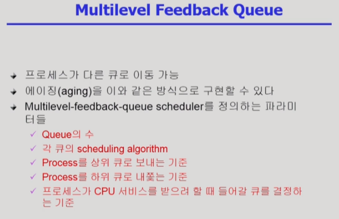

# 5차시 CPU Scheduling (9~11강)

## 9강 CPU Scheduling 0

>  CPU Scheduling 개요

- CPU burst : CPU만 사용하는 과정
- I/O burst : I/O만 사용하는 과정

- CPU bound job : CPU를 가장 많이 쓰는 업무
- I/O bound job : I/O를 많이 쓰고 CPU를 짧게 쓰는 업무

- CPU Scheduler
  - 운영체제 커널에 있는 코드
  - CPU를 누구한테 줄지 결정
- Dispatcher
  - 운영체제 커널에 있는 코드
  - CPU를 넘겨주는 과정을 담당

\* 주요 용어

Nonpreemptive(비선점형) : 강제로 빼앗지 않고 자진 반납

Preempive(선점형) : 강제로 빼앗음

## 10강 CPU Scheduling 1

> CPU Scheduling 종류

### CPU Scheduling의 성능 척도

- 시스템 입장에서의 척도
  - 이용률
    - 전체 시간에서 CPU가 일한 시간
  - 처리량
    - 주어진 시간 동안 몇 개의 작업을 완료했는가

- 프로그램(프로세스) 입장에서의 척도
  - 소요 시간, 반환 시간
    - CPU burst가 다 끝나고 나갈 때까지 걸린 시간 (기다린 시간 모두 포함)
    - 프로세스 시작부터 종료시간이 아닌 CPU를 사용하러 들어와서 I/O 하러 나갈 때까지 시간
  - 대기 시간
    - Ready que에서 CPU를 기다린 시간
  - 응답 시간
    - Ready que에서 처음으로 CPU를 할당 받기 까지의 시간

### Sceduling Algorithms

#### FCFS (First-Come First-Served) - Nonpreemptive

Convoy effect : 호위 효과

#### SJF(Shortest-Job-First) - Nonpreemptive, Preemptive

- 단점1
  - Starvation (기아 현상) : 자칫 잘못하면 시간이 긴 프로세스는 영영 CPU를 할당받지 못할 수 있다.
- 단점2

t : 실제 CPU 사용 시간

타우 : 예측한 CPU 사용 시간 

#### Priority Scheduling - Nonpreemptive, Preemptive

- 문제
  - Starvation(기아 현상) : 우선 순위가 낮은 프로세스는 영영 CPU를 할당 받지 못할 수 도 있다.
- 해결책
  - Aging(노화) : 기다릴 때마다 우선 순위를 증가시켜주는 방법

#### Round Robin - Preemptive

- 현재 많이 쓰이는 방법
- timer를 주고 시간 지나면 뺏는 방법
- 장점
  - 응답시간이 빠르다
  - 누가 CPU를 오래 쓰는지 모르는 상황에서 빠르게 나갈 수 있는 프로세스들도 빠르게 나갈 수 있다.
  - 대기시간이 본인의 CPU 사용 시간에 비례한다. (길게 쓰는 프로세스는 q time을 여러번 돌아야 하기 때문)
- 단점
  - 만약 전부 동일한 시간을 가진 프로세스인데 짧은 시간 텀이 주어진다면 각각을 모두 돌고 한번에 빠져나가기 때문에 기다리는 시간이 길다(But, 이건 특수한 케이스)

## 11강 CPU Scheduling 2

> CPU Scheduling 종류

### Sceduling Algorithms

#### Multilevel Queue

#### Multilevel Feedback Queue

- 보통 사용 방법
  - 처음 들어오는 프로세스를 Round Robin의 할당 시간을 짧게 주고 할당 시간을 한번 초과하면 그 다음 할당 시간을 좀 더 주는 대신 우선 순위가 낮은 큐에서 대기하는 방식

#### Multiple-Processor Scheduling

#### Real-Time Scheduling

- 정해진 시간이 되기 전까지 사용할 수 있도록 미리 스케쥴링을 해놓기도 한다.

#### Thread Scheduling

- Local Scheduling
  - User level thread이기 때문에 OS는 CPU를 thread에 할당하는게 아니라 process에 할당하고 process 안에서 알아서 thread 스케쥴링 함

- Global Scheduling
  - OS가 직접 thread에 스케쥴링

### Algorithm Evaluation

trace : Simulation에 들어가는 input 데이터

출처 : https://core.ewha.ac.kr/publicview/C0101020140325134428879622?vmode=f