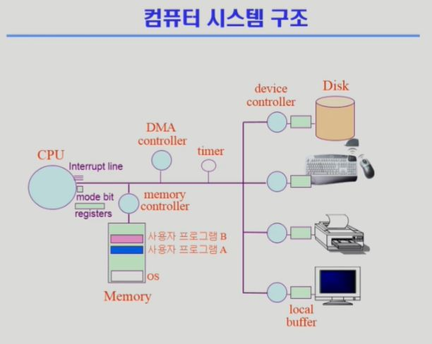
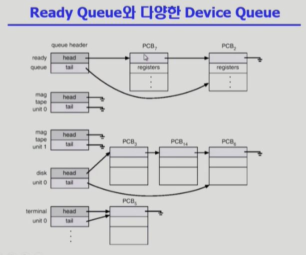

OS

## Chapter 2. System Structure & Program Excution

- 컴퓨터 시스템 구조

  - 

  - Computer : CPU + Memory

    - CPU : register(Memory보다 작고 빠른 연산자) + mode bit(OS, 사용자 명령 구분)  + Interrupt line(Memory, Disk 등의 연산이 끝났는지 확인)
      - program counter가 가리키는 register(memory 주소)에서 Instruction을 실행
    - Memory : CPU와 직접 동작하는 부분, 사용자의 요청 등을 처리함, CPU와 DMA controller만 접근 가능
    - CPU는 굉장히 빠른 장치로 Memory와 I/O에 접근하여 연산을 처리함. 만약 Memory에 무한루프가 걸리면 CPU의 시분할이 불가능해짐.
      - timer를 통해 특정 Memory의 CPU독점을 방지함
    - 사용자 프로그램은 직접 I/O에 접근할 수 없음. 따라서 OS를 통해서 I/O에 접근해야함. 
    - 그리고 OS는 사용자 프로그램에 CPU를 할당할 순 있으나, 강제로 다시 가져올 순 없음
    - 사용자 프로그램이 종료 (I/O 요청, 연산 종료 등) 또는 time out되면 CPU는 다시 OS에 할당됨
    - 만약 어떤 프로그램에서 CPU가 사용되고 있고, 다음 프로그램이 정해져 있더라도 I/O 큐or스택에 넣어놓은 연산이 완료되면 연산이 완료된 I/O에 할당 시킴
    - Mode bit
      - 사용자 프로그램의 잘못된 수행으로 다른 프로그램 및 운영체제에 피해가 가지 않도록 하기 위한 보호 장치
      - Mode bit을 총해 하드웨어적으로 두가지 모드의 operation지원
        - 1 : 사용자모드 : 사용자 프로그램이 CPU 사용중
          - 보안상의 목적으로 제한된 권한이 주어짐
        - 0 : 모니터모드 : OS가 CPU 사용중 ( == 커널모드, 시스템모드 )
          - memory 접근, I/O 접근 등 모든 권한을 가짐
        - Interrupt나 Exception 발생 시 하드웨어가 mode bit을 0으로 바꿈
        - OS가 사용자 프로그램에서 CPU를 넘기기 전에 mode bit을 1로 셋팅
    - Timer
      - 특정 프로그램이 CPU를 독점하는 것을 막기위해 사용
      - 정해진 시간이 흐른 뒤 OS에게 제어권이 넘어가도록 Interrupt를 발생시킴
    - 매 클럭 틱 때마다 1씩 감소
  
- I/O Device : Disk + Monitor + ...
  
  - I/O device controller
  
      - I/O 장치 유형을 관리하는 일종의 작은 CPU
      - 제어 정보(CPU의 요청)를 위해 control register, status register를 가짐
      - local buffer(Memory의 요청을 임시 저장)를 가짐 (일종의 data register)
      - device controller는 I/O가 끝났을 경우 interrup로 CPU에 그 사실을 알림
      - device driver (장치 구동기)
        - OS코드 중 각 장치별 처리 루틴 == software
      - device controller (장치 제어기)
      - 각 장치를 통제하는 일종의 작은 CPU == hardware
  
  - DMA controller
  
      - Director memory access
      - memory에 접근할수있는 다른 하나
      - memory controller가 교통정리의 역할
    - DMA는 I/O로 부터의 요청이 너무 많아 Interrupt가 자주 걸려 CPU의 효율이 떨어질 때, I/O의 요청을 memory에 대신 복사해줌으로 CPU 효율 증가
  
  - I/O의 수행
  
      - 모든 입출력 명령은 특권명령 (mode bit 0)
      - 사용자 프로그램은 어떻게 I/O를 하는가?
        - System call
          - 사용자 프로그램이 OS에 I/O를 요청
          - trap을 사용하여 interrupt vector의 특정 위치로 이동
          - 제어권이  interrupt vector가 가리키는 interrupt service routine으로 이동
          - 올바른 I/O 요청인지 확인 후 I/O 수행
          - I/O 완료 시 제어권을 System call 다음 명령으로 옮김
          - 즉, 사용자 프로그램이 OS의 서비스를 받기위해 커널 함수를 호출하는것
        - 
  
  - Interrupt
  
      - interrupt 당한 시점의 register와 program counter를 save한 후 CPU의 제어를 interrupt처리 routine에 넘긴다
      - 의미
        - interrupt (hardware) : 하드웨어가 발생시킨 interrupt
        - trap (software)
          - Exception : 프로그램이 오류를 범한 경우 ( ex. 1/0, mode bit 1일때, OS memory에 접근 시도 등 )
          - System Call : 프로그램이 커널 함수를 호출하는 경우 ( 사용자 프로그램이 OS에 요청하는 경우 )
      - 용어
        - interrupt vector
          - 해당 interrupt의 처리 루틴 주소를 가지고 있음
        - interrupt service routine (interrupt handler)
        - 해당 interrupt를 처리하는 커널 함수
  
      - 
        - Interrupt에 의해서 CPU가 움직이기 때문에,
-  동기식 입출력과 비동기식 입출력
  - 동기식 입출력 ( Synchronous I/O )
    - I/O 요청 후 입출력 작업이 완료된 후에야 제어가 사용자 프로그램에 넘어감
    - 구현방법 1
      - I/O가 끝날 때 까지 CPU를 낭비시킴
      - 매 시점 하나의 I/O만 일어날 수 있음
    - 구현방법 2
      - I/O가 완료될 때 까지 해당 프로그램에게서 CPU를 빼앗음
      - I/O 처리를 기다리는 줄에 그 프로그램을 줄 세움
      - 다른 프로그램에게 CPU를 줌
  - 비동기식 입출력 ( Asynchronous I/O )
    - I/O가 시작된 후 입출력 작업이 끝나기를 기다리지 않고 제어가 사용자 프로그램에 즉시 넘어감
  - 두가지 모두 I/O의 완료는 Interrupt로 알려줌
  - 
- DMA ( Direct Memory Access )
  - 빠른 입출력 장치를 메모리에 가까운 속도로 처리하기 위해 사용
  - CPU 중재 없이 device controller가 device의 buffer storage의 내용을 메모리에 block 단위로 직접 전송
  - byte 단위가 아니라 block 단위로 interrupt 발생시킴
  - 
- 서로 다른 입출력 명령어
  - 
  - 좌측이 일반적인 memory 접근 방법
    - memory addr와 device addr 각각으로 접근
  - 우측 Memory Mapped I/O
    - 연장된 memory addr를 통해 I/O에 접근
- 저장장치 계층 구조
  - 
  - Primary (Executable : 실행가능)
    - CPU가 직접 접근 가능, byte 단위 매체
    - Register, Cache : CPU, SRAM (휘발성)
    - Main : DRAM (휘발성)
  - Secondary : hard disk (비 휘발성)
    - byte 단위 접근 불가, sector 단위로 접근
- 프로그램의 실행 ( Memory load )
  - 
  - 모든 사용자 프로그램은 독자적인 가상공간을 가지고있음 ( 휘발성 )
  - 가상공간에 활성화된 부분을 물리적 메모리에 올려서 연산을 함
  - 연산이 끝났거나 보관이 필요한것이 아니라면 swap area로 내림
  - Swap area
    - Physical memory의 연장선 느낌
    - Physical memory가 용량 부족일때 쓰인다?
  - File system
    - on/off 등 데이터 유지에 쓰임
  - Address translation
    - 주소 관리자 ( 물리적 )
- 커널 주소 공간의 내용
  - 
  - Code : OS의 자원관리, 편리한 서비스 등 함수를 가지고 있음
  - Data : hardware 관리, 통제 및 자료구조(PCB)
  - stack : 함수를 호출할 때 사용, 사용자 프로그램마다 커널스택 따로 사용
- 사용자 프로그램이 사용하는 함수 (Code에 들어있음)
  - 사용자 정의 함수 -- 사용자 프로그램 addr space
    - 자신의 프로그램에서 정의한 함수
  - 라이브러리 함수 -- 사용자 프로그램 addr space
    - 자신의 프로그램에서 정의하지 않고 갖다 쓴 함수
    - 자신의 프로그램의 실행 파일에 포함되어 있음
  - 커널 함수 -- 커널 addr space
    - OS program의 함수
    - 커널 함수의 호출 = System call
- 프로그램 실행
  - 
  - 


## Chapter 3. Process

- Process is **a program in execution**

- 프로세스의 문맥 (context) : 현재 process의 상태를 규명하기 위해서 사용

  - CPU 수행 상태를 나타내는 하드웨어 문맥
    - Program Counter가 프로세스의 주소 공간 어디를 가리키고 있는가?
    - 각종 register에 어떤 값을 넣어두고 어떤 Instruction을 실행 했는가?
  - 프로세스의 주소 공간
    - code, data, stack
  - 프로세스 관련 커널(OS) 자료 구조
    - PCB (Process Control Block)
      - 프로세스를 관리하기위해 data 영역에 생성
      - process 하나 당 PCB 하나
    - Kernel stack
      - system call으로 kernel의 code를 호출할 때 process의 요청을 kernel stack에 저장
      - process 하나 당 Kernel stack 하나

- ### Process State - 1

  - 프로세스는 상태가 변경되며 수행된다
    - **Running**
      - CPU를 잡고 instruction을 수행중인 상태
    - Ready
      - CPU를 기다리는 상태 (메모리 등 다른 조건을 모두 만족하고)
      - ready 상태 process가 번갈아 가면서 수행되어 CPU time sharing이 일어남
    - **Blocked (wait, sleep)**
      - CPU를 주어도 당장 instruction을 수행할 수 없는 상태
      - Process 자신이 요청한 event(ex. I/O)가 즉시 만족되지 않아 이를 기다리는 상태
      - ex. 디스크에서 file을 읽어와야하는 경우
    - 경우에 따라
      - New
        - 프로세스가 생성중인 상태
      - Terminated
        - 수행 (Execution)이 끝난 상태
        - 정리만 남은 상태
    - **OS의 관리상 나누어진 상태**
  - 프로세스 상태도
    - 
    - 
      - Queue는 kernel addr의 Data에서 관리함

- ### Process Control Block ( PCB )

  - OS가 각 Process를 고나리하기 위해 process당 유지하는 정보
  - 아래의 구성 요소를 가짐 (구조체로 유지)
    - OS가 관리상 사용하는 정보
      - Process state, Process ID
      - Scheduling information, Priority
    - CPU 수행 관련 하드웨어 값
      - Program counter, register
    - Memory 관련
      - Code, Data, Stack의 위치 정보
    - File 관련
      - Open file description ...

- ### Context Switch ( 문맥 교환 )

  - CPU를 한 프로세스에서 다른 프로세스로 넘겨주는 과정
  - CPU가 다른 프로세스에게 넘어갈 때 OS는 아래를 수행
    - CPU를 내어주는 프로세스의 상태를 그 프로세스의 PCB에 저장
    - CPU를 새롭게 얻는 프로세스의 상태를 PCB에서 읽어옴
  - 
    - process가 CPU를 빼앗기게 될때 해당 시점을 process의 PCB에 CPU의 문맥을 저장함
    - CPU를 다시 받았을 때, CPU의 문맥을 통해 해당 시점부터 재시작
  - 
    - System call이나 Interupt 발생 시 반드시 context switch가 일어나는 것은 아님
      - 만약 CPU가 OS로 넘어갔다가 복귀하면 context switch가 아님
      - 그런데 OS에서 다른 프로세스로 CPU를 넘겨준다면 context switch
    - (1)의 경우에도 CPU의 수행 정보 등 context 일부를 PCB에 저장해야하지만, Context switch를 해야하는 (2)의 경우는 그 부담이 훨씬 큼
      - ex. cache memory flush

- ### 프로세스를 스케줄링하기 위한 큐

  - Job Queue
    - 현재 시스템 내에 있는 모든 프로세스의 집합
    - Ready queue와 Device queue 포함
  - Ready Queue
    - 현재 메모리 내에 있으면서 CPU를 잡아서 실행되기를 기다리는 프로세스의 집합
  - Device Queue
    - I/O device의 처리를 기다리는 프로세스의 집합
  - 프로세스들은 각 큐를 오가며 수행된다
  - 
    - Pointer를 통해 각 PCB가 연결됨
  - 

- ### Scheduler ( 스케줄러 )

  - **Long-term scheduler ( 장기 스케쥴러 or job scheduler)**
    - 시작 프로세스 중 어떤 것들을 **ready queue**로 보낼지 결정
    - 프로세스에 **memory** 및 각종 자원을 주는 문제
    - **degree of Multiprograming**을 제어
      - Memory에 올라가 있는 process의 수
      - ex. Memory : 10 , Process : 10 => degree of M : 10
      - ex. Momory : 10 , Process : 1 => degree of M : 1
      - Memory에 프로그램이 너무 많아도, 적어도 문제
    - time sharing system에는 보통 장기 스케줄러가 없음 (무조건 ready)
    - 프로그램이 시작될때 memory를 줄지 말지를 결정
  - **Short-term scheduler ( 단기 스케줄러 or CPU scheduler)**
    - 어떤 프로세스를 다음번에 **running** 시킬지 결정
    - 프로세스에 **CPU**를 주는 문제
    - milli-second 단위로 충분히 빨라야함
  - **Medium-term scheduler ( 중기 스케줄러 or Swapper )**
    - *여유 공간 마련을 위해  일부 프로세스를 통째로 memory에서 disk로 쫓아냄*
    - 프로세스에게서 **memory**를 뺏는 문제
    - **degree of Multiprograming**을 제어
    - memory에 너무많은 프로그램이 동시에 올라가있을 경우 작동

- ### Process State - 2

  - **Running, Ready, Blocked**
  - **Suspended (stopped)**
    - 외부적인 이유로 프로세스의 수행이 정지된 상태
    - 프로세스는 통째로 디스크에 swap out 된다
    - ex. 사용자가 프로그램을 일시정지시킨 경우 (break key) 
    - ex. 시스템이 여러 이유로 프로세스를 잠시 중단시킴 (메모리에 너무 많은 프로세스가 올라와 있을때)
    - 중기 스케줄러에 의해서 생겨났음
  - 비교
    - **Blocked**
      - **자신이 요청한 event가 만족되면 Ready**
    - **Suspended**
      - **외부에서 resume해 주어야 Active**
  - **OS의 상태를 나타내는게 아닌 사용자 프로세스가 kernel에서 어떤 상태(running, ready 등)에 있단것을 나타냄**
  - 프로세스 상태도
    - 
    - 점선 아래는 외부에서 어떤 신호를 줘야지 active로 올라올 수 있음

- ### Thread 

  - A **thread** ( or **lightweight process** ) is a basic unit of CPU utilization
    - cpu를 수행하는 단위
    - 하나의 프로세스 여러개의 thread == 아래보다 훨씬 가볍기에 lightweight process
    - 별도의 프로세스 각 한개의 thread  == heavyweight process
  - Thread의 구성 ( thread가 독립적으로 가지고있는 부분 )
    - program counter
    - register set
    - stack space
  - Thread가 동료 Thread와 공유하는 부분 ( = task )
    - code section
    - data section
    - OS resources
  - 전통적인 개념의 heavyweight process는 하나의 thread를 가지고 있는 task로 볼 수 있다.
  - 
    - program counter가 memory(process, 주소공간)의 어느부분을 가르키고 있는지 가지고 있음
    - code하나에 CPU수행단위가 여러개 == Thread
    - Thread는 메모리 주소공간, process state, 각종자원들을 공유함
    - program counter, register, stack은 Thread가 별도로 가지고있음
  - 다중 thread로 구성된 task구조에서는 하나의 서버 thread가 blocked( waiting )상태인 동안에도 동일한 task 내의 다른 thread가 실행 ( running )되어 빠른 처리를 할 수 있다.
    - Qest. 비동기랑 차이가 뭘까
  - 동일한 일을 수행하는 다중 thread가 협력하여 높은 처리율 ( throughput )과 성능 향상을 얻을 수 있다.
  - thread를 사용하면 병렬성을 높일 수 있다.
    - 다중 CPU일때, 각 thread를 서로 다른 cpu에서 사용
  - 
    - thread는 CPU와 관련된 정보만 별도로 가짐
    - PCB는 공유함
  - Benefit of Threads
    - **Responsiveness**
      - ex. multi-threaded Web
        - if one thread is blocked (ex, network)
        - another thread continues (ex. display)
    - **Resource Sharing**
      - n threads can share binary code, data, resource of the process
        - context switch 등에 많은 자원이 소모되는데 이를 방지함
    - **Economy**
      - creating & CPU switching thread ( rather than a process)
      - Solaris의 경우 두가지 overhead가 각각 30배, 5배
    - **Utilization of MultiProcessor Architectures**
      - each thread may be running in parallel on a diffrent process
  - Implementation of Threads
    - Some are supported by kernel == Kernel Threads
      - OS에서 thread가 여러개인걸 인지하고 있음
      - window 95/98/NT
      - Solaris
      - Digital UNIX, Mach
    - Others are supported by library == User Thread
      - OS에서 thread가 여러개인지 모르고 일반적인 thread로 알고있어서 구현상에 제약이 있음
      - 사용자가 사용
      - POSIX P-threads
      - Mach C-Threads
      - Solaris threads


- Process

  - Copy on write (COW)

    - linux와 같은 효율적인 OS(?)에서는 code, data, stack와 같은 메모리 공간을 공유하다가 자식이 달라질때 복제
    - write가 발생한 후에 부모 자식간 copy가 일어남
    - 원칙은 독립적이지만 가능한 공유함으로 효율성을 높임

  - fork() 시스템 콜

    - fork() 시스템콜로 프로세스가 만들어짐

      - caller의 중복된 주소공간이 새로 만들어짐

    - ```c++
      int main()
      {
          int pid;
          pid = fork();
          if (pid == 0)  /* this is child */
              printf("\n Hello, I an Child!\n");
          else if (pid > 0) /* this is parent */
              printf("\n Hello, I an parent! \n")
      }
      ```

      - 하나의 프로세스였지만 fork를 실행하면서 부모와 똑같은 자식 프로세스가 생성됨
      - 자식 프로세스는 fork 이후 시점부터 프로세스 실행
        - 자식은 부모의 문맥을 그대로 복사 (Program counter도 복사)하기 때문에 fork부터 실행
      - 부모 프로세스는 fork의 결과값이 양수, 자식 프로세스는 fork의 결과값이 0
        - 어떤게 부모 프로세스인지 판단하기위해서 쓰임

  - exec() 시스템콜

    - 어떤 프로그램을 완전히 새로운 프로세스로 만들어줌

      - caller의 메모리 이미지를 새로운 프로그램으로 대체함

    - ```c++
      int main()
      {
          int pid;
          pid = fork();
          if (pid == 0)  /* this is child */
          {
              printf("\n Hello, I an Child! Now I'ww run date\n");
              execlp("/bin/date", "/bin/date", (char *) 0);
          }
          else if (pid > 0) /* this is parent */
              printf("\n Hello, I an parent! \n")
      }
      ```

    - `execlp`를 만나는 순간 새로운 프로세스로 바뀜

      - 이제껏 했던 모든 프로세스를 잊고, `/bin/date`로 덮어쓰여짐

    - exec후에는 되돌아 갈 수 없음

    - fork가 없어도 exec을 사용할 수 있음

- wait() 시스템 콜

  - 프로세스 A가 wait() 시스템 콜을 호출하면
    - 커널은 child가 종료될 때까지 프로세스 A를 sleep 시킨다 (block 상태)
    - Child process가 종료되면 커널은 프로세스 A를 깨운다 (ready 상태)
  - 

- exit() 시스템 콜

  - 프로세스의 종료
    - 자발적 종료
      - 마지막 statement 수행 후 exit() 시스템 콜을 통해
      - 프로그램에 명시적으로 적어주지 않아도 main 함수가 리턴되는 위치에 컴파일러가 넣어줌
    - 비자발적 종료
      - 부모 프로세스가 자식 프로세스를 강제 종료 시킴
        - 자식 프로세스가 한계치를 넘어서는 자원 요청
        - 자식에게 할당된 task가 더이상 필요하지 않음
      - 키보드로 kill, break등을 친 경우
      - 부모가 종료하는 경우
        - 부모 프로세스가 종료하기 전에 자식들이 먼저 종료됨

- 프로세스와 관련한 시스템 콜

  - fork()
    - create a child (copy)
  - exec()
    - overlay new image
  - wait()
    - sleep until child is done
  - exit()
    - frees all the resources, notify parent

- 프로세스간 협력

  - 독립적 프로세스 (Independent Process)
    - 프로세스는 각자 주소 공간을 가지고 수행되므로 원칙적으로 하나의 프로세스는 다른 프로세스의 수행에 영향을 미치지 못함
    - 프로세스는 기본적으로 독립적임
  - 협력 프로세스 (Cooperating process)
    - 프로세스 협력 메커니즘을 통해 하나의 프로세스가 다른 프로세스의 수행에 영향을 미칠 수 있음
  - 프로세스 간 협력 메커니즘 ( *IPC*: Interprocess Communication)
    - 메세지를 전달하는 방법
      - **message passing**
        - 커널을 통해 메세지 전달
        - 프로세스간 메세지 전달은 원칙적으로 존재하지 않음
    - 주소 공간을 공유하는 방법
      - **shared memory**
        - 서로 다른 프로세스 간에도 일부 주소 공간을 공유하게함
        - 프로세스는 원칙적으로 독립적인 공간(물리적)을 가지지만 shared는 공유함
      - **thread**
        - thread는 사실상 하나의 프로세스이므로 프로세스 간 협력으로 보기에는 어렵지만, 동일한 process를 구성하는 thread들 간에는 주소 공간을 공유하므로 협력이 가능
    - 

- Message Passing

  - message system
    - 프로세스 사이에 공유 변수 (shared variable)를 일체 사용하지 않고 통신하는 시스템
  - Direct Communication
    - 통신하려는 프로세스의 이름을 명시적으로 표시
    - 
  - Indirect Communication
    - mailbox (or port)를 통해 메세지를 간접 전달
      - mailbox => 커널에 존재
      - 경우에따라 정해진 프로세스가 아닌 다른 프로세스에 전달 가능
    - 


## chapter 5. CPU scheduling

- CPU and I/O Bursts in Program Execution

  - 
  - 프로그램 종류에 따라서는 빈도와 길이가 달라질 수 있음

- CPU-burst Time의 분포

  - 
  - 여러 종류의 job (= process)이 섞여 있기 때문에 CPU 스케줄링이 필요하다.
    - interactive job에게 적절한 response제공 요망
    - CPU와 I/O 장치 등 시스템 자원을 골고루 효율적으로 사용
  - **I/O bound job**
    - CPU사용이 짧고 높은 freequency
      - CPU를 많이 사용하기 보다 CPU를 짧게 쓰지만 빈도가 잦음 (난도질 당함)
    - 사용자와 interaction
    - CPU를 잡고 계산하는 시간보다 I/O에 많은 시간이 필요함
    - *many short CPU bursts*
  - **CPU bound job**
    - CPU사용이 길고 낮은 freequency
      - CPU를 많이 사용함
    - 계산 위주
    - *few very long CPU bursts*

- CPU Scheduler & Dispatcher

  - CPU Scheduler

    - Ready 상태의 프로세스 중에서 이번에 CPU를 줄 프로세스를 고른다
    - OS안에서 CPU scheduling을 하는 코드를 Schduler라 부름

  - Dispatcher

    - CPU의 제어권을 CPU scheduler에 의해 선택된 프로세스에게 넘긴다
    - 이 과정을 context switch라 한다
    - OS 안에 존재하는 코드

  - CPU 스케줄링이 필요한 경우는 프로세스에게 다음과 같은 상태 변화가 있는 경우이다

    1. Running -> Blocked (ex. I/O 요청하는 시스템콜)
    2. Running -> Ready (ex. 할당시간 만료로 timer interrupt)
    3. Running -> Ready (ex. I/O 완료 후 인터럽트)
    4. Terminate

    - 1, 4에서의 스케줄링은 **nonpreemptive ( = 강제로 빼앗지 않고 자진 반납, 비선점형)**
    - 나머지 다른 스케줄링은 **preemptive ( = 강제로 빼앗음, 선점형, 현대의 스케줄링)**

- Scheduling Criteria

  - performance index (= performance measure, 성능 척도)
  - 시스템 입장에서의 성능 척도
    - **CPU utilization (이용률)**
      - 전체 시간 중 cpu가 연산한 시간
    - **Throughput (처리량)**
      - 주어진 시간동안 몇 개의 작업을 완료 했는지
  - 프로세스 입장에서의 성능 척도 (시간의 개념으로 나눔)
    - **Turnaround time (소요시간, 반환 시간)**
      - cpu를 사용하기 시작한 순간부터 빠져나가는 순간까지 걸린 시간 (cpu burst -> I/O burst)
    - **Waiting time (대기 시간)**
      - 기다린 시간
    - **Response time (응답 시간)**
      - ready queue에 들어온 순간 부터 cpu를 얻기까지 걸린 시간
      - 사용자가 결과를 받아보기까지 걸리는 시간
      - for time sharing environment

- Scheduling Algorithm

  - FCFS (First Come First Served)
    - 비선점형
    - 효율적이진 않음, 처리시간이 짧더라도 먼저 온 연산이 처리될 때 까지 기다려야함
    - 
    - 
      - Convoy effect : 긴 프로세스에 의해 짧은 프로세스가 기다리는 현상
  - SJF (Shortest Job First)
    - cpu burst가 가장 짧은 프로세스에 cpu를 할당
    - 평균 대기시간이 최소화
    - 비선점형
      - cpu burst가 더 짧은 프로세스가 존재하더라도 현재 처리중인 프로세스 계속 처리
    - 선점형
      - cpu burst가 더 짧은 프로세스가 있으면 현재 처리중인 프로세스를 중단하고 더 짧은 프로세스에 cpu 할당
      - 평균 대기 시간이 비선점형보다 짧음
      - SRTF
        - 남은 시간이 가장 짧은 프로세스 우선 처리
    - 문제점
      - Starvation
        - 극단적으로 cpu 사용 시간이 짧은 프로세스를 선호하기에, cpu 사용시간이 긴 프로세스는 영원히 처리 되지 않을 수 있음
      - CPU burst time 예측 불가
        - cpu를 할당 받은 순간에 cpu 사용 시간을 예측할 수 없음
        - 하지만, 사용시간을 추정할 순 있음 (과거의 cpu burst time을 기반으로 추정, exponential averaging)
    - 
    - 
      - 프로세스가 cpu를 쓰고 나가는 시점에 cpu 할당을 고민함
    - 
      - 프로세스가 들어오는 순간 cpu 할당을 고민함
      - 평균 대기시간이 3초보다 더 짧아 질 순 없음
  - Priority Scheduling
    - 우선순위가 높은 프로세스에 cpu 할당
    - 비선점형 vs 선점형 
      - cpu를 그대로 두거나, 뺏거나
    - 각 프로세스마다 우선순위를 나타내는 정수값을 지님
    - SJF와 같이 starvation을 지님
      - Aging을 통해 해결
    - 
  - Round Robin (RR)
    - 현대적인 CPU Scheduling
    - 선점형
    - 동일한 할당 시간을 설정하고 cpu를 프로세스에 할당
    - 응답시간이 빨라짐
    - 할당시간과 연산시간에 따라 대기시간이 길어질 수도 있음
      - 할당시간이 커지면 FCFS와 같아짐
      - 할당시간이 짧으면 cpu의 전환이 빈번해져 context switch가 많아지고 오버헤드가 커진다.
    - 프로세스의 context를 저장하고 다시 불러올 수 있음
    - 
    - 
      - RR은 SJF보다 응답시간은 짧지만, 평균 소요시간은 길다
      - 만약 cpu 사용 시간이 동일한 프로세스가 여러개 있다면, 모든 프로세스가 결국 거의 동시에 끝나게됨
    - 
  - Multilevel Queue
    - 위쪽일수록 높은 우선순위
    - 아래쪽으로 갈 수록 사람과 관련된 프로세스
    - 프로세스를 어느 줄에 넣을지, 무조건 우선 순위가 높은 프로세스에게만 cpu를 할당할지 등에 대한 고민이 필요
    - 
    - 
      - 사람과 상호작용을 하는 foreground는 RR 사용
      - CPU를 오래쓰고, 응답 시간이 짧을 필요가 없을 경우는 context switch overhead를 줄이기 위해 FCFS 사용
      - 어느 줄의 어느 프로세스에 cpu를 줄지 결정하기위한 스케줄링 필요
        - 줄 별로 cpu 시간을 나눔
  - Multilevel Feedback Queue
    - 처음 들어오는 프로세스의 우선순위가 가장 높고, RR의 할당시간이 가장 짧음
    - 할당시간내에 프로세스를 끝내지 못하면 아래쪽으로 내려가고 ( 우선순위가 떨어지고 ), 아래로 갈수록 할당시간이 길어짐
    - 
    - 
  - Multiple Processor Scheduling
    - CPU가 여러 개인 경우 스케줄링은 더욱 복잡해짐
    - **Homogeneous processor인 경우**
      - Queue에 한줄로 세워서 각 프로세서가 알아서 꺼내가게 할 수 있다.
      - 반드시 특정 프로세서에서 수행되어야하는 프로세스가 있는 경우에는 문제가 더 복잡해짐
    - **Load sharing**
      - 일부 프로세서에 job이 몰리지 않도록 부하를 적절히 공유하는 메커니즘 필요
      - 별개의 큐를 두는 방법 vs 공동 큐를 사용하는 방법
    - **Symmetric Multiprocessing (SMP)**
      - 각 프로세서가 각자 알아서 스케줄링 결정
    - **Asymmetric multiprocessing**
      - 하나의 프로세서가 시스템 데이터의 접근과 공유를 책임지고 나머지 프로세스는 거기에 따름
  - Real Time Scheduling
    - Hard real time system
      - 정해진 시간 안에 반드시 끝내도록 스케줄링 해야함
    - Soft real time system
      - 일반 프로세스에 비해 높은 우선순위를 갖도록 해야함
  - Thread Scheduling
    - Local Scheduling
      - User level thread의 경우 사용자 수준의 thread library에 의해 어떤 thread를 스케줄할지 결정
      - 사용자 프로세스가 thread를 관리하고 OS는 thread의 존재를 모름
    - Global Scheduling
      - Kernel level thread의 경우 일반 프로세스와 마찬가지로 커널의 단기 스케줄러가 어떤 thread를 스케줄할지 결정
      - OS가 thread의 존재를 알고 있음
  
- Algorithm Evaluation ( 평가 )

  - **Queueing models**
    - **확률 분포**로 주어지는 **arrival rate**와 **service rate** 등을 통해 각종 **performance index** 값을 계산
    - 이론적인 방법
    - 
      - server == cpu
    - 요즘에는 실제 시스템에 구현을 중요하게 여기기에 잘 사용하지 않음
  - **Implementation ( 구현 ) & Measurement ( 성능 측정 )**
    - **실제 시스템**에 알고리즘을 **구현**하여 실제 작업 ( **workload** )에 대해서 성능을 **측정** 비교
  - **Simulation ( 모의실험 )**
    - 알고리즘을 **모의 프로그램**으로 작성 후 **trace** ( 시뮬레이션에 들어갈 input데이터 )를 입력으로 하여 결과 비교


## Chapter 6. Process Synchronization

- 데이터의 접근
  - 
    - 누가 먼저 데이터를 읽느냐에 따라서 결과가 달라질 수 있음
- Race Condition
  - 
  - OS에서 race condition 발생 예시
    - kernel 수행 중 인터럽트 발생시
      - 
        - 데이터 공유가 일어나는동안 interrupt를 막아서 interrupt handler의 연산은 무시됨
    - Process가 system call을 하여 kernel mode로 수행 중인데 context switch가 일어나는 경우
      - 
      - 
    - Multiprocessor에서 shared memory 내의 kernel data
      - 
- Process Synchronization 문제
  - 공유 데이터( shared data )의 동시 접근( concurrent access )은 데이터의 불일치 문제( inconsistency )를 발생 시킬 수 있다.
  - 일관성( consistency ) 유지를 위해서는 협력 프로세스 간의 실행 순서( orderly execution )를 정해주는 메커니즘 필요
  - Race Condition
    - 여러 프로세스들이 동시에 공유 데이터를 접근하는 상황
    - 데이터의 최종 연산 결과는 마지막에 그 데이터를 다룬 프로세스에 따라 달라짐
  - race condition을 막기 위해서는 concurrent process는 동기화( synchronize ) 되어야 한다
- Example
  - 
  - The Critical-Section Problem
    - n개의 프로세스가 공유 데이터를 동시에 사용하기를 원하는 경우
    - 각 프로세스의 code segment에는 공유 데이터를 접근하는 코드인 critical section이 존재
    - Problem
      - 하나의 프로세스가 critical section에 있을 때 다른 모든 프로세스는 critical section에 들어갈 수 없어야 한다.
    - 
      - P2는 P1이 끝날때 까지 기다려야함
  - 

