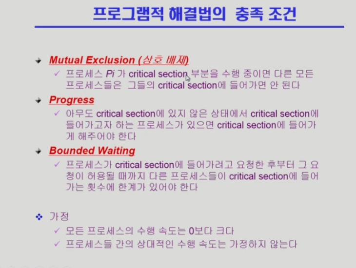
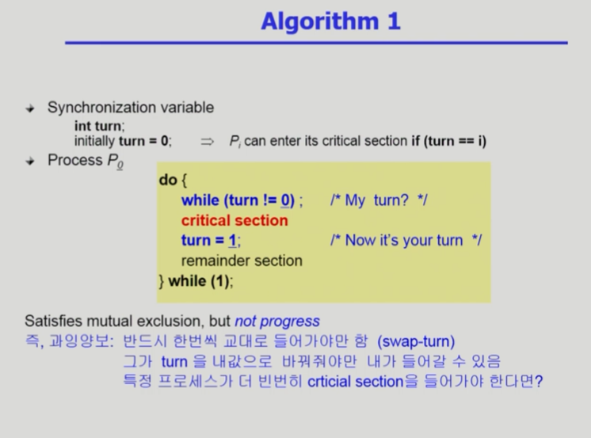
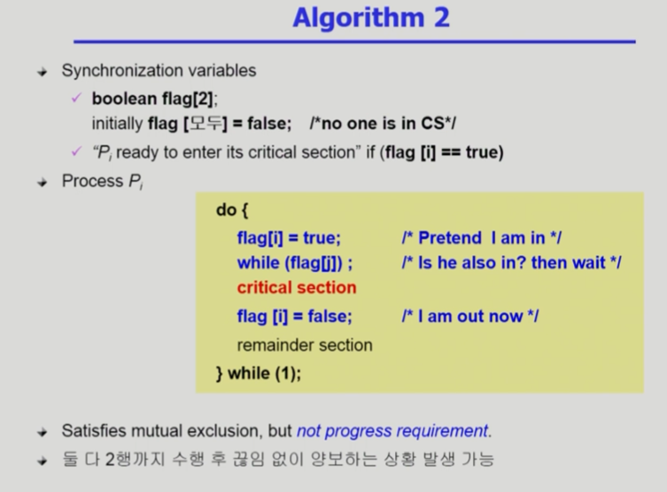
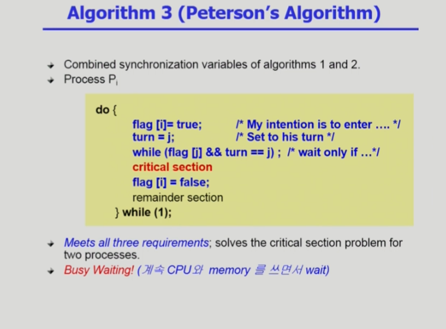
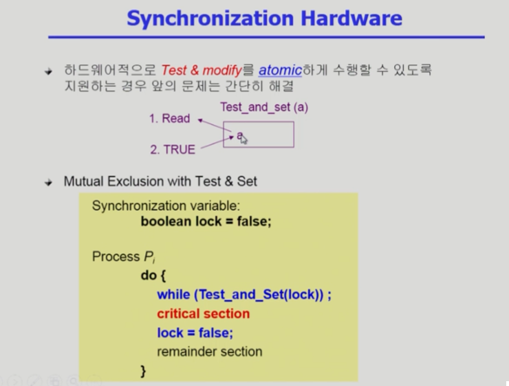

## ProcessSynchronization 1

- CPU는 인스트럭션 단위로 실행되는데 하이레벨 언어들은 하나의 구문도 여러 개의 인스트럭션으로 합쳐져 있기 때문에 실행 도중 CPU를 빼앗길 수 있다.
- 이 때문에 Progress가 확실히 이루어져야 한다.

- critical section을 처리한 후 turn을 설정해주기 전에 프로세스를 뺐기면 progress가 보장되지 않는다.

- 마찬가지로 progress가 보장되지 않는다. 

- 플래그와 turn 변수를 모두 사용하면 문제가 발생하지 않는다.
- 다만, waiting을 CPU와 memory를 전부 사용하면서 오래하게 된다는 문제가 있다.

- 이러한 문제들은 전부 하나의 수행 코드가 하나의 인스트럭션으로 이루어져있지 않기 때문.
- 하나의 인스트럭션으로 이루어진 Test & Modify 같은 함수를 사용하면 쉽게 해결이 가능하다.
