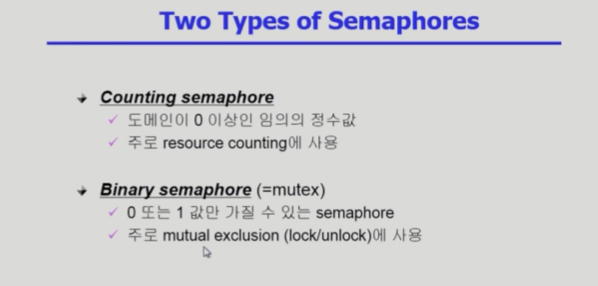

## Process Synchronization 2

- 사용자가 직접 할 필요 없이 추상화된 Semaphores를 사용하면 쉽게 가능하다.
- P연산과 V연산이 있다. 세마포어는 인티저 정수 자료형이다.
- P연산을 하면 S가 하나씩 내려가고, V연산을 하면 S가 하나씩 올라간다.
- P는 lock 자원이 있으면 가져가고, S는 unlock 자원을 다 쓰면 반납하는 과정이라고 할 수 있다.

- S를 1로 설정하면 critical 문제를 해결할 수 있다.

- busy wating 대신 block & wakeup으로 해결.
- 굳이 무한반복문으로 기다릴 필요 없이 애초에 CPU할당이 안되도록 구현.

- S가 음수면 리스트에 대기하고 블락.
- S를 반납해도 음수면 누군가가 블락된 상황. 즉 누군가가 블락상태라는 뜻이므로 리스트에서 제거해주고 wakeup시켜줘야 한다.

- Critical section의 길이에 따라 다르게 적용하는 것이 좋지만, 일반적으로는 Block/wakeup이 좋다.

- 필요한 세마포어가 두 개 이상이면 데드락이 발생할 수 있다. 서로 계속 기다리기만 하기 때문.
- 획득 순서를 지정해주면 해결이 가능하다.

