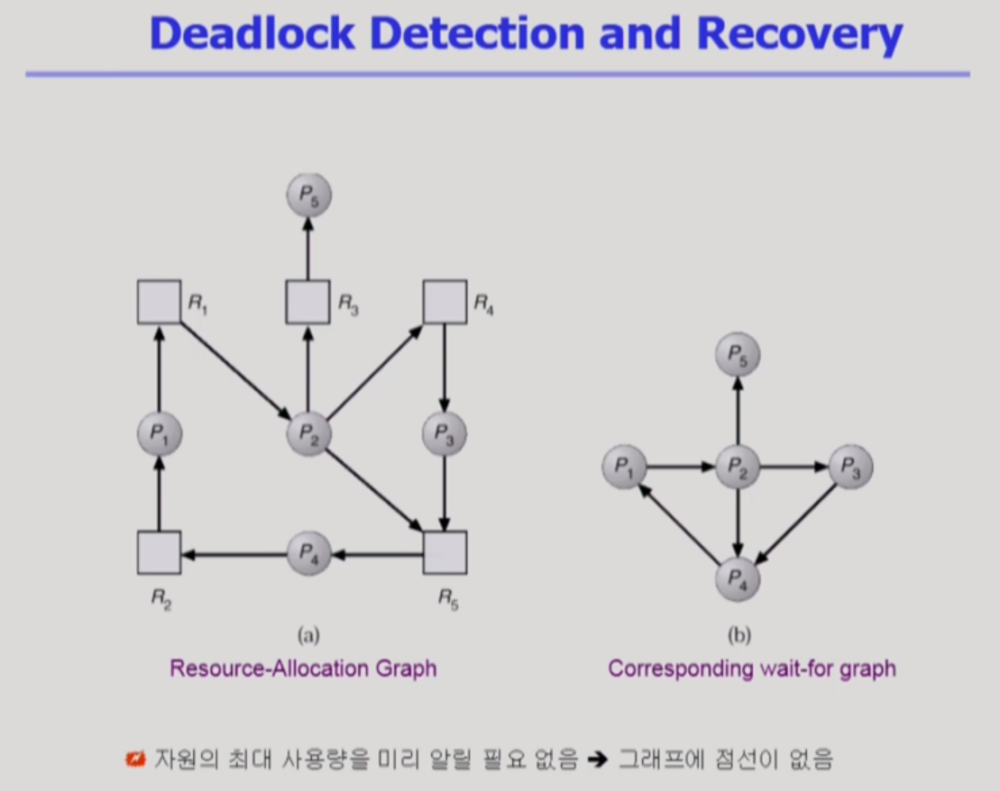

7차시 Deadlock (16~17강)

## 16강 Deadlock 1

>  Deadlocks 개요 & 처리 방법 1

- Process -> Resource : 자원을 요청
- Resource -> Process : 자원을 할당
- 왼쪽은 Deadlock (O)
- 오른쪽은 Deadlock (X)

### Deadlock 처리 방법

#### Deadlock Prevention

#### Deadlock Avoidance

- process 가 시작될 때 이 process 가 평생 쓸 자원을 미리 계산하고 deadlock이 발생할것 같지 않을 때 만 자원을 할당하는 방식
- safe state : deadlock이 발생하지 않는 상태로 유지

- 2가지 경우
  - 자원 당 인스턴스가 1개
  - 자원 당 인스턴스가 여러 개

##### 자원 당 인스턴스가 1개

- 점선 : 프로세스가 해당 자원을 평생에 한번은 쓸 가능성이 있다.
- 아래쪽처럼 자원 당 인스턴스가 하나여도 table로 해도 된다.

##### 자원 당 인스턴스가 여러 개

## 17강 Deadlock 2

> Deadlock 처리 방법 2

#### Deadlock Detection and Recovery

- 요청이 없는 프로세스(P0, P2)는 현재 할당된 것을 다 쓰고 반납한다고 가정하고,
- 요청이 없는 프로세스부터 할당된 것을 반납하고, 그것들을 이용해 available을 늘이고 이를 통해 Request를 하나씩 해결해 나간다.
- 만약 이렇게 진행하다가 중간에 막혔을 경우 Deadlock

#### Deadlock Ignorance

- Deadlock이 생겼을 때 아무것도 하지 않는 것.
- Deadlock이 생기면 느려지거나 process가 정지되거나 하면 이를 사용자가 알아채서 알아서 처리하는 방법이다.
- 현재 대다수의 운영체제에서 가장 많이 쓰이는 방법
  - 왜?
    - Deadlock Detection이나 Deadlock을 처리하는 과정 자체가 overhead가 더 클 수 있기 때문
    - Deadlock이 잘 발생하지 않기 때문

출처 : https://core.ewha.ac.kr/publicview/C0101020140411151510275738?vmode=f